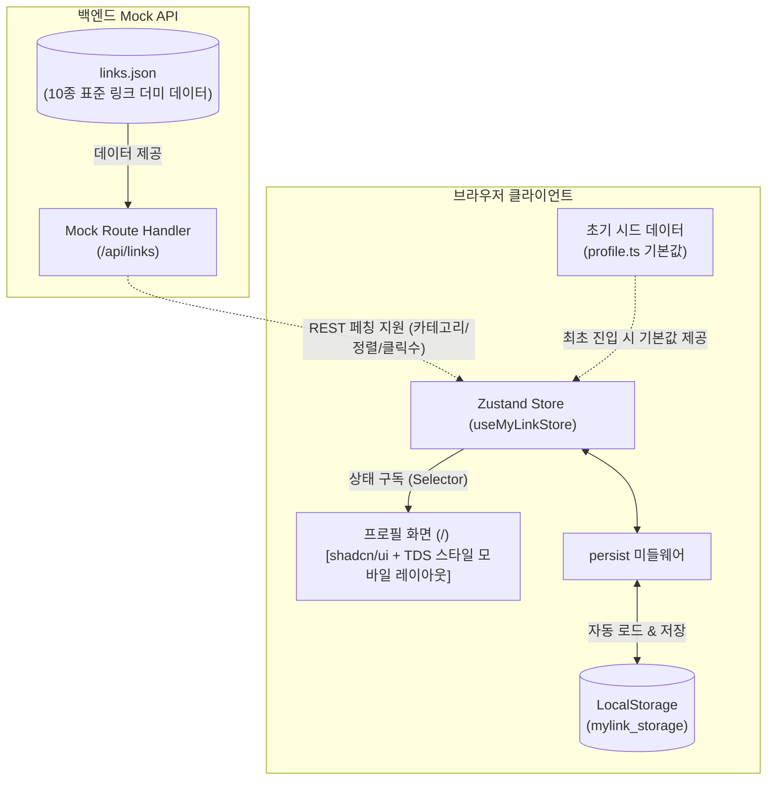

# 📄 [PRD] 마이링크 (MyLink) - 1단계: 로컬 스토리지 기반 프로필 페이지

---

## 1. 프로젝트 개요 (Overview)

### 1.1 서비스 목적 및 시연 배경
본 프로젝트는 **링크트리 클론 서비스 "마이링크(MyLink)"**를 라이브 시연 및 단계별(Step-by-step)로 구축하기 위한 1단계 개발 명세서입니다.  
복잡한 관리자 대시보드나 분석(Analytics) 기능은 추후 단계로 미루고, **Zustand와 LocalStorage를 연동하여 동적으로 렌더링되는 모바일 친화적 프로필 페이지**를 완성하는 것을 목표로 합니다.

### 1.2 1단계 핵심 목표
- **정적 데이터 탈피**: 기존 하드코딩된 프로필 페이지를 **Zustand 스토어 + LocalStorage** 기반의 동적 상태 구조로 전면 전환.
- **로컬 영속화**: 브라우저의 LocalStorage에 저장된 데이터를 읽어와 프로필 및 링크 목록을 렌더링.
- **shadcn/ui 기반 토스 디자인 시스템(TDS) 구축**:
  - 컴포넌트 아키텍처는 **shadcn/ui** 프리미티브(`Card`, `Button`, `Badge`, `Avatar` 등)를 기반으로 구축.
  - 시각적 디자인과 인터랙션은 **[`design.md`](file:///d:/coding_class/my-link/design.md)의 토스 디자인 시스템(TDS)**을 완벽히 계승 (Toss Blue `#3182F6`, Cool Greyscale `#191F28`~`#F9FAFB`, Pretendard 서체, 16~24px 둥근 모서리, `active:scale-[0.98]` 터치 피드백, 해요체 톤앤매너).
- **Tailwind CSS 단일 스타일링 표준**:
  - 모듈 CSS(`*.module.css`)를 일체 사용하지 않고, 모든 스타일링을 **100% Tailwind CSS 유틸리티 클래스로 통일**하여 디자인 토큰 일관성과 컴포넌트 재사용성을 극대화.
- **SSR Hydration 안정성**: Next.js 16 / React 19 환경에서 LocalStorage 로딩 시 깜빡임이나 Hydration 에러 방지.

---

## 2. 시스템 아키텍처 (1단계)



---

## 3. 사용자 시나리오 (User Scenarios)

### 3.1 시나리오 1: 신규 방문자의 첫 진입 (First-time Experience)
- **페르소나**: 마이링크 링크를 처음 전달받아 접속한 방문자
- **진행 흐름**:
  1. 방문자가 웹 브라우저에서 마이링크 주소(`/`)로 접속합니다.
  2. 브라우저에 저장된 데이터가 없는 상태(LocalStorage Empty)를 감지합니다.
  3. 시스템이 내장된 **기본 시드 데이터(이지성 프로필 샘플)**를 즉시 로드합니다.
  4. React 19 Hydration 깜빡임이나 레이아웃 깨짐 없이 완성도 높은 프로필 정보가 모바일 친화적 화면으로 렌더링됩니다.
- **결과**: 방문자는 호스트의 아바타, 이름, 자기소개, 태그, SNS 목록, 링크 목록을 딜레이 없이 쾌적하게 열람합니다.

### 3.2 시나리오 2: 링크 카드 및 소셜 채널 탐색 (Interaction)
- **페르소나**: 호스트의 작업물과 SNS를 둘러보고자 하는 방문자
- **진행 흐름**:
  1. 프로필 상단의 **소셜 아이콘 바**에서 GitHub 또는 Instagram 아이콘을 클릭합니다.
  2. 새 브라우저 탭(`_blank`)으로 해당 소셜 미디어 프로필 페이지가 열립니다.
  3. 프로필 본문의 **shadcn/ui 기반 TDS 링크 카드**(예: "포트폴리오 보러가기")를 탭/클릭합니다.
  4. 토스 특유의 부드러운 스케일 피드백(`active:scale-[0.98]`)과 함께 외부 목적지 웹사이트로 즉시 이동합니다.
- **결과**: 활성화된 모든 외부 링크가 빠르고 직관적으로 연결됩니다.

### 3.3 시나리오 3: 로컬스토리지 영속성 및 동적 갱신 시연 (Live Demo: Data Persistence)
- **페르소나**: 발표자 / 시연자
- **진행 흐름**:
  1. 시연자가 브라우저 개발자 도구(F12 -> Application -> LocalStorage 또는 Console)를 엽니다.
  2. `mylink_storage`의 프로필 이름(`displayName`)이나 링크 목록 데이터를 임의로 수정합니다.
  3. 웹 브라우저를 새로고침(F5)합니다.
  4. 하드코딩된 정적 페이지가 아니므로, 방금 수정한 프로필 정보와 링크가 그대로 유지되어 화면에 렌더링됩니다.
- **결과**: 로컬 스토리지를 기반으로 상태가 안전하게 영속화되는 동적 웹앱임을 청중에게 명확히 입증합니다.

### 3.4 시나리오 4: 모바일 디바이스 뷰포트 탐색 (Mobile-First Experience)
- **페르소나**: 스마트폰 환경에서 인스타그램 프로필 링크 등을 통해 접속한 모바일 사용자
- **진행 흐름**:
  1. 토스 앱 특유의 쿨그레이 캔버스(`grey-50: #F9FAFB`)와 뷰포트 너비(`max-w-md`) 최적화 레이아웃이 적용됩니다.
  2. 한 손 엄지손가락으로 조작하기 편한 48~52px 이상의 큼직한 터치 타겟과 부드러운 햅틱 인터랙션을 경험합니다.
- **결과**: shadcn/ui의 탄탄한 컴포넌트 접근성 위에 토스 디자인 시스템(TDS)의 유려한 감성을 결합한 모바일 경험을 제공합니다.

---

## 4. 메인 화면(방문자 뷰) 와이어프레임 & 레이아웃 명세

```text
┌─────────────────────────────────────────────────────────┐
│  ● MYLINK                                        [공유] │  <-- Top Navigation (shadcn Button / Ghost)
├─────────────────────────────────────────────────────────┤
│                                                         │
│                       [ 👨‍💻 ]                            │  <-- Avatar (shadcn Avatar, 88x88, TDS 라운드/보더)
│                       이지성                            │  <-- Display Name (20px bold TDS grey-900)
│                     @jisung.dev                         │  <-- Username Handle (13px TDS grey-500)
│                                                         │
│         "더 나은 사용자 경험을 고민하는 프론트엔드      │  <-- Bio 한 줄 소개 (TDS grey-700, 해요체)
│          개발자입니다. 간결한 서비스를 만들어요."       │
│                                                         │
│        [Next.js 16]   [React 19]   [TypeScript]         │  <-- Tags (shadcn Badge, TDS grey-100 pill)
│                                                         │
│          [GitHub]    [Instagram]   [YouTube]   [Mail]   │  <-- Social Icon Bar (shadcn Button, 40x40, rounded-2xl)
│                                                         │
├─────────────────────────────────────────────────────────┤
│ 📌 주요 링크 (FEATURED)                                 │  <-- Section Header (14px semibold TDS grey-600)
│                                                         │
│ ┌─────────────────────────────────────────────────────┐ │
│ │ [📝]  기술 블로그 (Tech Blog)                    >  │ │  <-- shadcn Card (TDS ListRow 스타일, rounded-2xl)
│ │       Next.js와 웹 성능 최적화 개발 기록            │ │
│ └─────────────────────────────────────────────────────┘ │
│                                                         │
│ ┌─────────────────────────────────────────────────────┐ │
│ │ [📂]  웹 포트폴리오 사이트                       >  │ │  <-- shadcn Card (TDS ListRow 스타일, rounded-2xl)
│ │       진행했던 주요 프로젝트와 작업물 모아보기      │ │
│ └─────────────────────────────────────────────────────┘ │
│                                                         │
│ 💬 소통 및 채널 (CHANNELS)                              │  <-- Section Header (14px semibold TDS grey-600)
│                                                         │
│ ┌─────────────────────────────────────────────────────┐ │
│ │ [☕]  1:1 커피챗 신청하기                        >  │ │  <-- shadcn Card (TDS ListRow 스타일, rounded-2xl)
│ │       커리어 및 개발 질문 언제든 환영해요           │ │
│ └─────────────────────────────────────────────────────┘ │
│                                                         │
├─────────────────────────────────────────────────────────┤
│            [🔗 나만의 마이링크 무료로 만들기]           │  <-- Bottom Primary CTA (TDS Blue 500, 52px)
│         © 2026 MyLink. Built with shadcn/ui & TDS.      │
└─────────────────────────────────────────────────────────┘
```

### 4.1 컴포넌트별 상세 UI 명세 (shadcn/ui + TDS 커스터마이징)
1. **Top Navigation (`TopBar`)**:
   - 높이 56px, 반투명 블러 백그라운드(`backdrop-blur-md bg-[#F9FAFB]/80 border-b border-[#E5E8EB]`).
   - 우측 공유 버튼: shadcn `Button` (`variant="ghost"`, `size="sm"`, `text-[#4E5968] hover:bg-[#F2F4F6] rounded-xl`), 클릭 시 클립보드 복사 + 토스 스타일 토스트 안내.
2. **Profile Hero (`ProfileHero`)**:
   - 아바타: shadcn `Avatar` 컴포넌트 (`AvatarImage`, `AvatarFallback`, `w-[88px] h-[88px] rounded-full border-2 border-white shadow-sm`).
   - 이름: `text-[20px] font-bold text-[#191F28] tracking-tight`.
   - 핸들: `text-[13px] font-normal text-[#8B95A1]`.
   - 소개글(Bio): `text-[15px] text-[#4E5968] leading-relaxed`, 해요체 적용.
   - 태그: shadcn `Badge` 컴포넌트 (`variant="secondary"`, `bg-[#F2F4F6] text-[#4E5968] hover:bg-[#E5E8EB] rounded-full px-3 py-1 font-medium`).
3. **Social Icons Bar (`SocialBar`)**:
   - shadcn `Button` 컴포넌트 (`variant="outline"`, `size="icon"`, `w-10 h-10 rounded-2xl bg-white border-[#E5E8EB] text-[#4E5968] hover:bg-[#F2F4F6] hover:text-[#191F28]`).
   - 햅틱 인터랙션: `active:scale-95 transition-all duration-150`.
4. **shadcn/ui 기반 TDS Link Card (`LinkCard`)**:
   - shadcn `Card` 프리미티브를 TDS ListRow로 커스텀 스타일링 (`bg-white rounded-2xl border border-[#E5E8EB] p-4 transition-all duration-200 cursor-pointer`).
   - 좌측: 44x44px 연한 그레이 배경(`bg-[#F2F4F6] rounded-xl`)의 아이콘 박스 (Lucide 아이콘).
   - 중앙: 16px 타이틀(`font-semibold text-[#191F28]`) + 13px 서브타이틀(`text-[#8B95A1]`).
   - 우측: 20px `ChevronRight` Lucide 아이콘 (`text-[#B0B8C1] group-hover:text-[#3182F6] transition-colors`).
   - 호버/액티브 인터랙션: 호버 시 `border-[#3182F6]` 및 소프트 섀도우, 클릭 시 `active:scale-[0.98] transition-transform`.
5. **Bottom Primary CTA**:
   - shadcn `Button` (`bg-[#3182F6] hover:bg-[#1B64DA] text-white font-bold h-[52px] rounded-2xl w-full active:scale-[0.98] shadow-sm`).

---

## 5. 기능 요구사항 명세 (Functional Requirements)

### 5.1 프로필 헤더 (Profile Hero)
- **FR-01 (아바타 & 기본 정보)**:
  - 프로필 이미지(원형 아바타, 테두리 스타일)
  - 사용자 표시 이름(DisplayName) 및 핸들/아이디(`@username`)
  - 한 줄 소개(Bio) 문구
  - 관심사/역할 태그 뱃지 목록

### 5.2 소셜 미디어 아이콘 바 (Social Icons)
- **FR-02 (SNS 바로가기 바)**:
  - GitHub, Instagram, LinkedIn, X(Twitter), YouTube, Email 등 활성화된 소셜 링크를 가로 아이콘 바 형태로 노출
  - 각 아이콘 클릭 시 새 창(`_blank`)으로 해당 SNS 연결

### 5.3 콘텐츠 블록 렌더링 (Links & Section Headers)
- **FR-03 (섹션 헤더/구분선)**:
  - 링크 그룹을 구분하는 깔끔한 텍스트 헤더 블록 렌더링 (`text-sm font-semibold text-[#6B7684] px-1`)
- **FR-04 (shadcn/ui 기반 TDS 링크 카드)**:
  - shadcn/ui `Card` 프리미티브를 바탕으로 [`design.md`](file:///d:/coding_class/my-link/design.md)의 **TDS ListRow 규격**을 완벽히 구현
  - 좌측: 44x44px 라운드 아이콘 컨테이너 (`bg-[#F2F4F6] rounded-xl`, Lucide 아이콘 또는 이모지)
  - 중앙: 링크 타이틀(Title, 16px semibold `#191F28`) + 서브 텍스트(Subtitle, 13px `#8B95A1`)
  - 우측: Chevron 화살표 (`ChevronRight`, `#B0B8C1`)
  - 호버/클릭 인터랙션: 마우스 호버 시 토스 블루 보더(`border-[#3182F6]`) 트랜지션, 탭/클릭 시 TDS 특유의 `active:scale-[0.98]` 햅틱 스케일 피드백
  - `enabled: true`인 블록만 화면에 표시

### 5.4 로컬 스토리지 동기화 & 시드 / 더미 데이터
- **FR-05 (초기 시드 데이터 자동 적재)**:
  - 사용자가 처음 접속하여 LocalStorage가 비어있는 경우, 기존 "이지성" 프로필 데이터를 기본값으로 자동 로드.
- **FR-06 (LocalStorage 변경 감지 및 영속성)**:
  - LocalStorage에 저장된 프로필/링크 정보가 변경되면 페이지 새로고침 시에도 변경된 데이터가 그대로 유지.
- **FR-07 (표준 링크 더미 데이터 및 백엔드 Mock API 연동)**:
  - **표준 JSON 더미 데이터 (`src/data/links.json`) 채택**: 개발, 커리어, 연락처, 소셜 4개 카테고리 총 10개의 실제 서비스 수준 링크 데이터를 제공.
  - **토스 디자인 시스템(TDS) 어조 일치**: 제목과 서브타이틀은 일관된 친근한 해요체(대화형 존댓말)로 작성.
  - **Next.js App Router 백엔드 Mock API (`/api/links`) 지원**:
    - `GET /api/links`: 카테고리(`?category=...`), 활성 여부(`?activeOnly=true`), 정렬(`?sort=popular|latest|order`), 키워드 검색(`?search=...`) 쿼리 지원.
    - `POST /api/links`: 링크 클릭 이벤트 기록(`{ action: "click", linkId: "..." }`) 및 동적 링크 추가 Mock 동작 지원.
    - 로컬 스토리지 시드 데이터뿐 아니라 향후 REST API 페칭 구조로의 손쉬운 확장을 보장.

---

## 6. 데이터 모델 명세 (Data Schema)

### 6.1 프로필 및 블록 모델 (`src/types/mylink.ts`)

```typescript
// src/types/mylink.ts

export interface SocialLink {
  id: string;
  platform: "github" | "instagram" | "twitter" | "youtube" | "linkedin" | "email" | "website";
  url: string;
  enabled: boolean;
}

export interface LinkItem {
  id: string;
  type: "link";
  title: string;
  url: string;
  description?: string;
  icon?: string;
  enabled: boolean;
}

export interface HeaderItem {
  id: string;
  type: "header";
  title: string;
  enabled: boolean;
}

export type ContentBlock = LinkItem | HeaderItem;

export interface ProfileData {
  username: string; // 핸들 (예: 'jisung')
  displayName: string; // 이름
  bio: string; // 소개글
  avatarUrl: string; // 프로필 이미지
  tags: string[]; // 태그 뱃지 목록
  socials: SocialLink[]; // 소셜 링크
  blocks: ContentBlock[]; // 링크 및 헤더 블록 목록
}
```

### 6.2 링크 더미 데이터 및 Mock API 모델 (`src/types/index.ts` & `src/data/links.json`)

```typescript
// src/types/index.ts

export type LinkCategory = "all" | "dev" | "career" | "social" | "contact";

export interface MockLinkItem {
  id: string;
  title: string;
  subtitle: string;
  url: string;
  category: "dev" | "career" | "social" | "contact";
  categoryLabel: string;
  iconName: string;
  badge?: string;
  isExternal: boolean;
  order: number;
  clickCount: number;
  isActive: boolean;
  createdAt: string;
  updatedAt: string;
}

export interface LinksApiResponse {
  status: "success" | "error";
  code: number;
  message: string;
  data: MockLinkItem[];
  meta: {
    totalCount: number;
    activeCount: number;
    categories: {
      id: string;
      label: string;
      count: number;
    }[];
  };
}
```

---

## 7. 제외 대상 범위 (Out of Scope for Step 1)

시연의 호흡과 집중도를 위해 아래 기능은 이번 단계에서 개발하지 않으며 다음 마일스톤으로 분리합니다.

- ❌ 관리 대시보드 (`/dashboard` 및 좌우 분할 스플릿 에디터)
- ❌ 클릭수/방문자수 통계(Analytics) 집계 및 차트
- ❌ 실시간 테마 커스텀 팔레트 전환기
- ❌ 다중 사용자 인증(Auth) 및 회원가입

---

## 8. 비기능적 요구사항 (Non-Functional Requirements)

1. **Next.js 16 / React 19 Hydration 호환성**:
   - 클라이언트 사이드에서 LocalStorage를 읽을 때 서버 렌더링 HTML과의 불일치 에러(Hydration Mismatch)가 발생하지 않도록 Hydration 안전 가드 적용.
2. **반응형 모바일 최적화**:
   - 모바일 뷰포트(`max-w-md`)를 1차 기준으로 하여 데스크톱에서도 중앙 정렬된 모바일 앱 형태의 완성도 높은 비주얼 제공.
3. **shadcn/ui + 토스 디자인 시스템(TDS) 통합 표준 준수**:
   - **컴포넌트 아키텍처**: `@/components/ui/*` 경로의 shadcn/ui 프리미티브 컴포넌트(`Button`, `Card`, `Badge`, `Avatar` 등)를 레고 블록 형태로 조합(Composition)하여 확장성과 접근성(WAI-ARIA)을 보장.
   - **디자인 토큰 ([`design.md`](file:///d:/coding_class/my-link/design.md) 기준 커스터마이징)**:
     - **브랜드 컬러**: 화면당 1개의 핵심 CTA에만 예약된 Toss Blue (`blue-500: #3182F6`, `blue-600: #1B64DA`, 배경 `blue-50: #E8F3FF`).
     - **그레이스케일**: 차가운 쿨그레이 캔버스 (`grey-50: #F9FAFB`), 보조 서피스 (`grey-100: #F2F4F6`), 기본 보더/디바이더 (`grey-200: #E5E8EB`), 보조 텍스트 (`grey-700: #4E5968`), 본문 텍스트 (`grey-900: #191F28`).
     - **라운드 체계**: 공격적이지만 절제된 라운드 적용 — 버튼/카드 `rounded-2xl` (16~20px), 칩/태그 `rounded-full` (999px), 대형 블록 24px.
     - **타이포그래피**: Pretendard Variable 기반, 타이트한 자간(`tracking-tight`), 수치 표기 시 `tabular-nums` 적용.
     - **모션 및 햅틱 피드백**: 터치/클릭 시 미세 스케일 다운(`active:scale-[0.98]` / `active:scale-95`), `cubic-bezier(0.22, 0.61, 0.36, 1)` 트랜지션.
     - **보이스 앤 톤**: 해요체(대화형 존댓말, `-요`)를 UI 카피에 일관되게 적용.
4. **Tailwind CSS 단일 스타일링 체계 (CSS Modules 배제)**:
   - 본 프로젝트의 모든 UI 컴포넌트는 **모듈 CSS(`*.module.css`)를 일체 배제**하고 **Tailwind CSS 유틸리티 클래스로 100% 통일**합니다.
   - shadcn/ui 기반의 프리미티브 컴포넌트(`@/components/ui/*`)와 TDS 커스텀 스타일 모두 Tailwind CSS 클래스 체계로 통일하여 스타일 파편화를 방지하고 유지보수성 및 재사용성을 보장합니다.

---

## 9. 1단계 실행 순서 (Action Steps)

1. **Step 1-1: 상태 관리 패키지 준비**
   - `zustand` 설치
2. **Step 1-2: 타입 정의 및 기본 시드 / 더미 데이터 구성**
   - `src/types/mylink.ts` 및 `src/types/index.ts` 타입 선언
   - `src/data/defaultProfile.ts`에 프로필 기본 시드 데이터 정의
   - `src/data/links.json`에 표준 10종 링크 더미 데이터(카테고리별) 정의
   - `src/app/api/links/route.ts`에 백엔드 Mock API 엔드포인트 구현 (필터/정렬/클릭 카운트)
3. **Step 1-3: Zustand Store 생성 (`useMyLinkStore`)**
   - `persist` 미들웨어를 적용하여 `localStorage`의 `mylink_profile` 키와 연동
4. **Step 1-4: shadcn/ui + TDS 스타일 프로필 컴포넌트 개발**
   - 필요 시 `npx shadcn@latest add <component>`로 프리미티브 컴포넌트 추가 (`avatar`, `badge`, `card` 등)
   - `design.md`의 TDS 토큰과 스타일링을 shadcn 컴포넌트에 입혀 프로필 뷰 조립
5. **Step 1-5: 동작 검증**
   - 브라우저 개발 서버 실행 및 LocalStorage 연동/TDS 스타일 반응형 UI 정상 작동 확인

