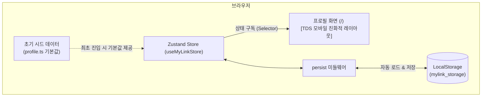

# 📄 [PRD] 마이링크 (MyLink) - 1단계: 로컬 스토리지 기반 프로필 페이지

---

## 1. 프로젝트 개요 (Overview)

### 1.1 서비스 목적 및 시연 배경
본 프로젝트는 **링크트리 클론 서비스 "마이링크(MyLink)"**를 라이브 시연 및 단계별(Step-by-step)로 구축하기 위한 1단계 개발 명세서입니다.  
복잡한 관리자 대시보드나 분석(Analytics) 기능은 추후 단계로 미루고, **Zustand와 LocalStorage를 연동하여 동적으로 렌더링되는 모바일 친화적 프로필 페이지**를 완성하는 것을 목표로 합니다.

### 1.2 1단계 핵심 목표
- **정적 데이터 탈피**: 기존 하드코딩된 프로필 페이지를 **Zustand 스토어 + LocalStorage** 기반의 동적 상태 구조로 전면 전환.
- **로컬 영속화**: 브라우저의 LocalStorage에 저장된 데이터를 읽어와 프로필 및 링크 목록을 렌더링.
- **토스 디자인 시스템(TDS) 완성도**: 모바일 뷰포트에 최적화된 유려한 프로필 헤더, 소셜 아이콘 바, 링크 카드, 섹션 헤더 구현.
- **SSR Hydration 안정성**: Next.js 16 / React 19 환경에서 LocalStorage 로딩 시 깜빡임이나 Hydration 에러 방지.

---

## 2. 시스템 아키텍처 (1단계)



---

## 3. 사용자 시나리오 (User Scenarios)

### 3.1 시나리오 1: 신규 방문자의 첫 진입 (First-time Experience)
- **페르소나**: 마이링크 링크를 처음 전달받아 접속한 방문자
- **진행 흐름**:
  1. 방문자가 웹 브라우저에서 마이링크 주소(`/`)로 접속합니다.
  2. 브라우저에 저장된 데이터가 없는 상태(LocalStorage Empty)를 감지합니다.
  3. 시스템이 내장된 **기본 시드 데이터(이지성 프로필 샘플)**를 즉시 로드합니다.
  4. React 19 Hydration 깜빡임이나 레이아웃 깨짐 없이 완성도 높은 프로필 정보가 모바일 친화적 화면으로 렌더링됩니다.
- **결과**: 방문자는 호스트의 아바타, 이름, 자기소개, 태그, SNS 목록, 링크 목록을 딜레이 없이 쾌적하게 열람합니다.

### 3.2 시나리오 2: 링크 카드 및 소셜 채널 탐색 (Interaction)
- **페르소나**: 호스트의 작업물과 SNS를 둘러보고자 하는 방문자
- **진행 흐름**:
  1. 프로필 상단의 **소셜 아이콘 바**에서 GitHub 또는 Instagram 아이콘을 클릭합니다.
  2. 새 브라우저 탭(`_blank`)으로 해당 소셜 미디어 프로필 페이지가 열립니다.
  3. 프로필 본문의 **TDS 링크 카드**(예: "포트폴리오 보러가기")를 탭/클릭합니다.
  4. 부드러운 스케일/터치 피드백과 함께 외부 목적지 웹사이트로 즉시 이동합니다.
- **결과**: 활성화된 모든 외부 링크가 빠르고 직관적으로 연결됩니다.

### 3.3 시나리오 3: 로컬스토리지 영속성 및 동적 갱신 시연 (Live Demo: Data Persistence)
- **페르소나**: 발표자 / 시연자
- **진행 흐름**:
  1. 시연자가 브라우저 개발자 도구(F12 -> Application -> LocalStorage 또는 Console)를 엽니다.
  2. `mylink_storage`의 프로필 이름(`displayName`)이나 링크 목록 데이터를 임의로 수정합니다.
  3. 웹 브라우저를 새로고침(F5)합니다.
  4. 하드코딩된 정적 페이지가 아니므로, 방금 수정한 프로필 정보와 링크가 그대로 유지되어 화면에 렌더링됩니다.
- **결과**: 로컬 스토리지를 기반으로 상태가 안전하게 영속화되는 동적 웹앱임을 청중에게 명확히 입증합니다.

### 3.4 시나리오 4: 모바일 디바이스 뷰포트 탐색 (Mobile-First Experience)
- **페르소나**: 스마트폰 환경에서 인스타그램 프로필 링크 등을 통해 접속한 모바일 사용자
- **진행 흐름**:
  1. 모바일 뷰포트 너비에 맞게 최적화된 카드 너비(`max-w-md`)와 안전 영역(Safe area) 패딩이 적용됩니다.
  2. 한 손 엄지손가락으로 조작하기 편한 48px 이상의 터치 타겟과 부드러운 스크롤 인터랙션을 경험합니다.
- **결과**: 모바일 앱에 준하는 깔끔한 토스 디자인 시스템(TDS) 사용자 경험을 제공합니다.

---

## 4. 메인 화면(방문자 뷰) 와이어프레임 & 레이아웃 명세

```text
┌─────────────────────────────────────────────────────────┐
│  ● MYLINK                                        [공유] │  <-- Top Navigation
├─────────────────────────────────────────────────────────┤
│                                                         │
│                       [ 👨‍💻 ]                            │  <-- Avatar (88x88)
│                       이지성                            │  <-- Display Name (20px bold)
│                     @jisung.dev                         │  <-- Username Handle (13px)
│                                                         │
│         "더 나은 사용자 경험을 고민하는 프론트엔드      │  <-- Bio 한 줄 소개
│          개발자입니다. 간결한 서비스를 만듭니다."       │
│                                                         │
│        [Next.js 16]   [React 19]   [TypeScript]         │  <-- Tags (Pill Badges)
│                                                         │
│          [GitHub]    [Instagram]   [YouTube]   [Mail]   │  <-- Social Icon Bar (40x40)
│                                                         │
├─────────────────────────────────────────────────────────┤
│ 📌 주요 링크 (FEATURED)                                 │  <-- Section Header
│                                                         │
│ ┌─────────────────────────────────────────────────────┐ │
│ │ [📝]  기술 블로그 (Tech Blog)                    >  │ │  <-- TDS Link Card 1
│ │       Next.js와 웹 성능 최적화 개발 기록            │ │
│ └─────────────────────────────────────────────────────┘ │
│                                                         │
│ ┌─────────────────────────────────────────────────────┐ │
│ │ [📂]  웹 포트폴리오 사이트                       >  │ │  <-- TDS Link Card 2
│ │       진행했던 주요 프로젝트와 작업물 모아보기      │ │
│ └─────────────────────────────────────────────────────┘ │
│                                                         │
│ 💬 소통 및 채널 (CHANNELS)                              │  <-- Section Header
│                                                         │
│ ┌─────────────────────────────────────────────────────┐ │
│ │ [☕]  1:1 커피챗 신청하기                        >  │ │  <-- TDS Link Card 3
│ │       커리어 및 개발 질문 언제든 환영해요           │ │
│ └─────────────────────────────────────────────────────┘ │
│                                                         │
├─────────────────────────────────────────────────────────┤
│            [🔗 나만의 마이링크 무료로 만들기]           │  <-- Bottom Branding CTA
│             © 2026 MyLink. Toss Design System.          │
└─────────────────────────────────────────────────────────┘
```

### 4.1 컴포넌트별 상세 UI 명세
1. **Top Navigation (`TopBar`)**:
   - 높이 56px, 반투명 블러 백그라운드(`backdrop-blur-md`).
   - 우측 공유 버튼 클릭 시 현재 페이지 URL 클립보드 복사 + TDS 토스트 안내.
2. **Profile Hero (`ProfileHero`)**:
   - 아바타: 88px 원형 + 2px 화이트 헤어라인 보더 + 소프트 그림자.
   - 이름: `text-xl font-bold text-[#191F28]`.
   - 태그: 둥근 필 뱃지(`rounded-full`), 연한 블루/그레이 배경.
3. **Social Icons Bar (`SocialBar`)**:
   - 40x40px 라운드 사각형(`rounded-2xl`), 화이트 배경, 1px 보더.
   - 터치 시 미세 스케일 다운(`active:scale-95`).
4. **TDS ListRow Link Card (`LinkCard`)**:
   - 패딩 16px, 둥근 모서리(`rounded-2xl`), 화이트 서피스.
   - 좌측: 44x44px 연한 배경의 아이콘 박스.
   - 중앙: 15px 타이틀 + 13px 서브타이틀(회색조 `#8B95A1`).
   - 우측: 20px Chevron 우측 화살표 (`>`).
   - 마우스 호버 시 보더 컬러 토스 블루(`border-[#3182F6]`) 트랜지션.

---

## 5. 기능 요구사항 명세 (Functional Requirements)

### 5.1 프로필 헤더 (Profile Hero)
- **FR-01 (아바타 & 기본 정보)**:
  - 프로필 이미지(원형 아바타, 테두리 스타일)
  - 사용자 표시 이름(DisplayName) 및 핸들/아이디(`@username`)
  - 한 줄 소개(Bio) 문구
  - 관심사/역할 태그 뱃지 목록

### 5.2 소셜 미디어 아이콘 바 (Social Icons)
- **FR-02 (SNS 바로가기 바)**:
  - GitHub, Instagram, LinkedIn, X(Twitter), YouTube, Email 등 활성화된 소셜 링크를 가로 아이콘 바 형태로 노출
  - 각 아이콘 클릭 시 새 창(`_blank`)으로 해당 SNS 연결

### 5.3 콘텐츠 블록 렌더링 (Links & Section Headers)
- **FR-03 (섹션 헤더/구분선)**:
  - 링크 그룹을 구분하는 깔끔한 텍스트 헤더 블록 렌더링
- **FR-04 (TDS 링크 카드)**:
  - 좌측: 44px 아이콘 컨테이너 (Lucide 아이콘 또는 이모지)
  - 중앙: 링크 타이틀(Title) + 서브 텍스트(Subtitle/Description)
  - 우측: Chevron 화살표 (`>`)
  - 호버/클릭 인터랙션: TDS 특유의 부드러운 스케일/배경색 트랜지션
  - `enabled: true`인 블록만 화면에 표시

### 5.4 로컬 스토리지 동기화 & 시드 데이터
- **FR-05 (초기 시드 데이터 자동 적재)**:
  - 사용자가 처음 접속하여 LocalStorage가 비어있는 경우, 기존 "이지성" 프로필 데이터를 기본값으로 자동 로드.
- **FR-06 (LocalStorage 변경 감지 및 영속성)**:
  - LocalStorage에 저장된 프로필/링크 정보가 변경되면 페이지 새로고침 시에도 변경된 데이터가 그대로 유지.

---

## 6. 데이터 모델 명세 (Data Schema)

```typescript
// src/types/mylink.ts

export interface SocialLink {
  id: string;
  platform: "github" | "instagram" | "twitter" | "youtube" | "linkedin" | "email" | "website";
  url: string;
  enabled: boolean;
}

export interface LinkItem {
  id: string;
  type: "link";
  title: string;
  url: string;
  description?: string;
  icon?: string;
  enabled: boolean;
}

export interface HeaderItem {
  id: string;
  type: "header";
  title: string;
  enabled: boolean;
}

export type ContentBlock = LinkItem | HeaderItem;

export interface ProfileData {
  username: string; // 핸들 (예: 'jisung')
  displayName: string; // 이름
  bio: string; // 소개글
  avatarUrl: string; // 프로필 이미지
  tags: string[]; // 태그 뱃지 목록
  socials: SocialLink[]; // 소셜 링크
  blocks: ContentBlock[]; // 링크 및 헤더 블록 목록
}
```

---

## 7. 제외 대상 범위 (Out of Scope for Step 1)

시연의 호흡과 집중도를 위해 아래 기능은 이번 단계에서 개발하지 않으며 다음 마일스톤으로 분리합니다.

- ❌ 관리 대시보드 (`/dashboard` 및 좌우 분할 스플릿 에디터)
- ❌ 클릭수/방문자수 통계(Analytics) 집계 및 차트
- ❌ 실시간 테마 커스텀 팔레트 전환기
- ❌ 다중 사용자 인증(Auth) 및 회원가입

---

## 8. 비기능적 요구사항 (Non-Functional Requirements)

1. **Next.js 16 / React 19 Hydration 호환성**:
   - 클라이언트 사이드에서 LocalStorage를 읽을 때 서버 렌더링 HTML과의 불일치 에러(Hydration Mismatch)가 발생하지 않도록 Hydration 안전 가드 적용.
2. **반응형 모바일 최적화**:
   - 모바일 환경을 기본으로 하여 데스크톱에서도 최대 너비(`max-w-md` 또는 `max-w-lg`)로 중앙 정렬되어 깔끔한 앱 스타일 제공.
3. **토스 디자인 시스템(TDS) 감성 유지**:
   - `grey-50 (#F9FAFB)` 캔버스, `grey-900 (#191F28)` 본문 컬러, 라운드 카드(`rounded-2xl`).

---

## 9. 1단계 실행 순서 (Action Steps)

1. **Step 1-1: 상태 관리 패키지 준비**
   - `zustand` 설치
2. **Step 1-2: 타입 정의 및 기본 시드 데이터 구성**
   - `src/types/mylink.ts` 생성
   - `src/data/defaultProfile.ts`에 시드 데이터 정의
3. **Step 1-3: Zustand Store 생성 (`useMyLinkStore`)**
   - `persist` 미들웨어를 적용하여 `localStorage`의 `mylink_profile` 키와 연동
4. **Step 1-4: 프로필 페이지 컴포넌트 리팩터링**
   - 기존 하드코딩된 컴포넌트들을 Zustand 스토어를 구독하도록 교체
5. **Step 1-5: 동작 검증**
   - 브라우저 개발 서버 실행 및 LocalStorage 연동 정상 작동 확인
